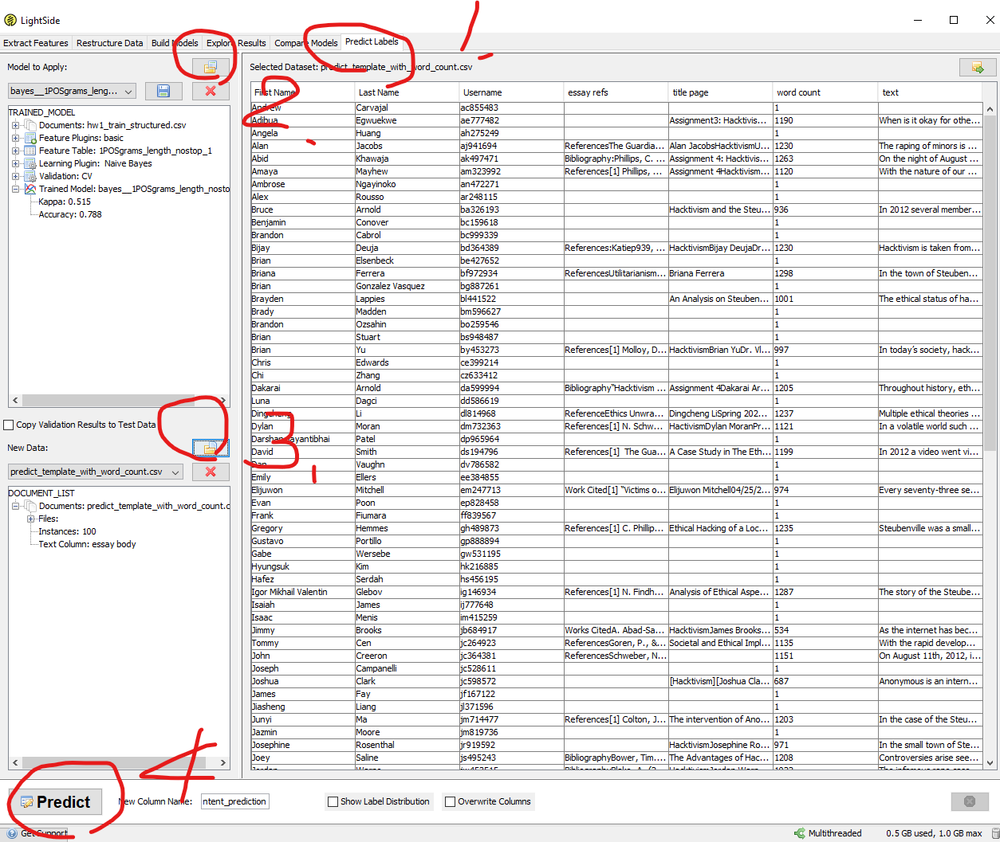

# Requirements
- Python 3  
Python 3, and the dependent packages can be found in `requirements.txt` file

- LighSIDE  
This is an open source text analysis software, the file has been included in this folder, but you can also download it [here](http://ankara.lti.cs.cmu.edu/side/)

# Folder explenation
### **gensimscripts**
This folder was used in early stage to test the accuracy of LSA models, it turns out the result is similar to the feature engineered model. For the convenience of consistency, we chose the feature engineered model at the end.
### **classifiers folder**
This folder holds all the trained model classifiers in the folder as well as the training data generated by helperscripts in each according folders
### **essays**
Essays folder holds the raw file of the student submission
### **gradbook**
This folder holds the graded assignments
### **helperscripts**
This folder holds the python helperscripts that helps to transform the docx essays into spreadsheets, including parsing docx, manipulating spreadsheets and post process the rank into score and writing comments.
  - aes_system.py  
  This will be the only program that end user will be executing because all the other scripts are imported to this file. The user just need to change the appropriate parameters and does not need to go deep in other scripts.

  - post_process.py  
  This script holds the class PostProcessor

  - read_docx.py  
  This script holds the class DocxReader

  - write_into_gradebook.py  
  This script holds the functions for manipulating spreadsheets in pandas DataFrame.

# How to use LightSIDE to predict scores
Open the LightSIDE program, and 
1. Click on "Predict labels" label
2. load the models (they are under the folder `classifiers`)
3. load the predict templates ()
4. for each model, click predict.
5. save the result to a specified output

And you are ready to go to the next step!