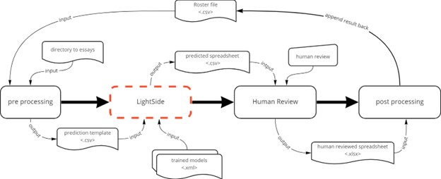
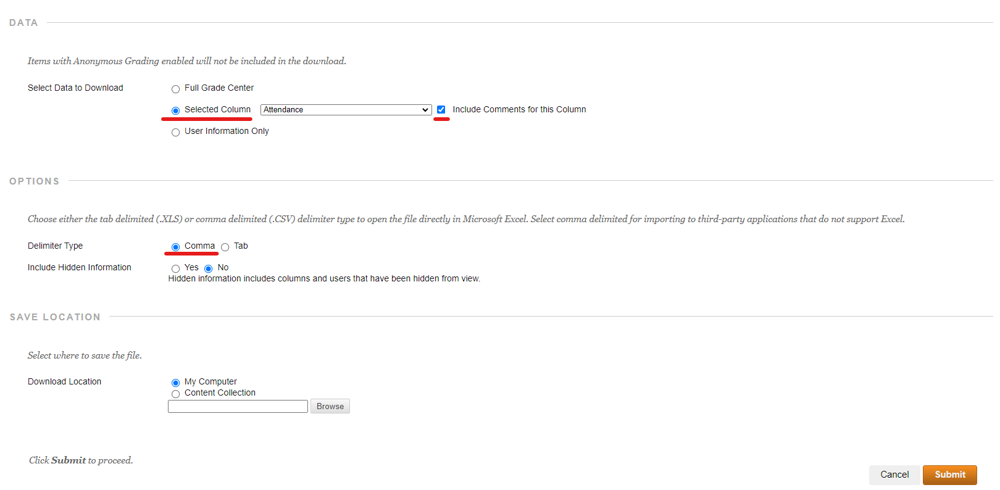
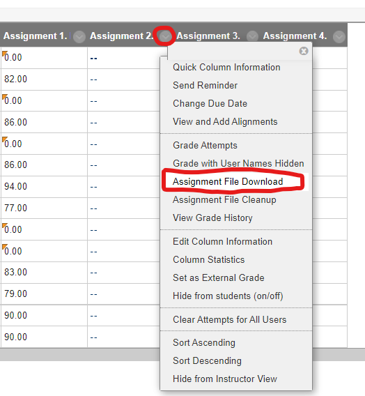
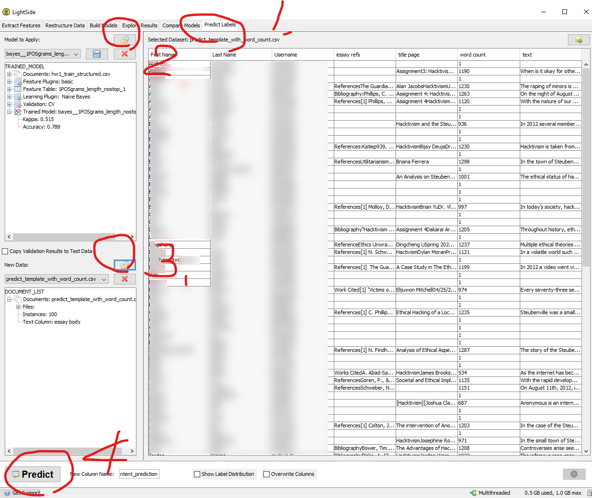

# Essay Grading Helper

  
  

# Table of Content
1. [Requirements](#requirements)

2. [System Pipline](#system-pipeline)

3. [Prequesist](#prerequisites)
    * [Download Roster File](#download-roster-file-from-blackboard)
    * [Download Assignment Files](#download-assignment-files)
    * Organize your files
4. [Folder Explanation](#folder-explenation)

5. [How to use LightSIDE to predict scores](#how-to-use-lightside-to-predict-scores)

# Requirements
- Python 3  
Python 3, and the dependent packages can be found in `requirements.txt` file

- LighSIDE  
This is an open source text analysis software; you can also download it [here](http://ankara.lti.cs.cmu.edu/side/)

# System Pipeline

  

# Prerequisites
In order to use this system, you also need the roster file/gradebook spreadsheet and the assignments from Blackboard downloaded on your local machine.
## Download Roster File From Blackboard
**Step 1.** Go to the `Full Grade Center` on Blackboard, hover over `Work Offline` and click `Download`.

**Step 2.** Select the column to the assignment number you want to grade, and check the `Include Comments for this Column` box.

**Step 3.** Under `Options`, we recommend to choose `Comma` as delimiter type and download as a csv file. (as shown below) Depending on the file you download, make sure you choose the appropriate settings when reading this file. (see section...)

  

**Step 4.** Click `Submit` and you should be able to download your roster file.

## Download Assignment Files

**Step 1.** Go to `Assignments` section on Blackboard, click the downward arrow of the assignment that you wish to download and select `Assignment File Download` (see picture on the right)

**Step 2.** Select all the files (check last attempt file under `select file` section) and click `Submit`

**Setp 3.** The assignment files should be downloaded on your local machine as a zip file.

## Organize Your files into appropriate folders
Although you can put your files anywhere you like, we recommend to organized the files in a certain way to make the following process easier to follow and keep your files organized.

1. put your roster file under the folder: `./gradebook/<hw_code>/` e.g. assignment1 in spring 2022 semester could be `hw1_s22`

2. put your essay files under the folder `./essays/<hw_code>/`

# Folder explenation
### **classifiers folder**
This folder holds all the trained model classifiers in the folder as well as the training data generated by helperscripts in each according folders
### **essays**
Essays folder holds the raw file of the student submission
### **gradebook**
This folder holds the graded assignments
### **helperscripts**
This folder holds the python helperscripts that helps to transform the docx essays into spreadsheets, including parsing docx, manipulating spreadsheets and post process the rank into score and writing comments.
  - aes_system.py  
  This will be the only program that end user will be executing because all the other scripts are imported to this file. The user just need to change the appropriate parameters and does not need to go deep in other scripts.

  - post_process.py  
  This script holds the class PostProcessor

  - read_docx.py  
  This script holds the class DocxReader

  - write_into_gradebook.py  
  This script holds the functions for manipulating spreadsheets in pandas DataFrame.

# How to use LightSIDE to predict scores
Open the LightSIDE program, and 
1. Click on "Predict labels" label
2. load the models (they are under the folder `classifiers`)
3. load the predict templates ()
4. for each model, click predict.
5. save the result to a specified output

And you are ready to go to the next step!